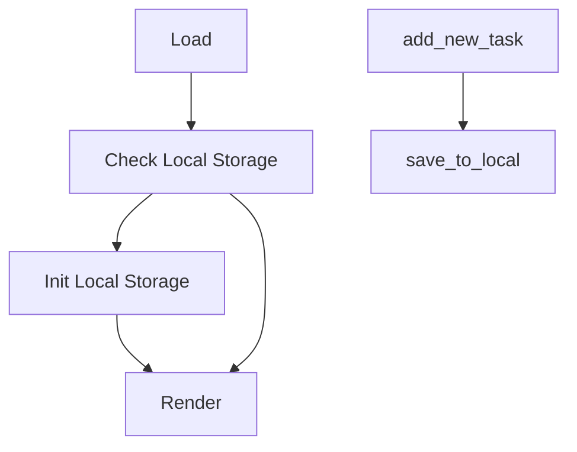
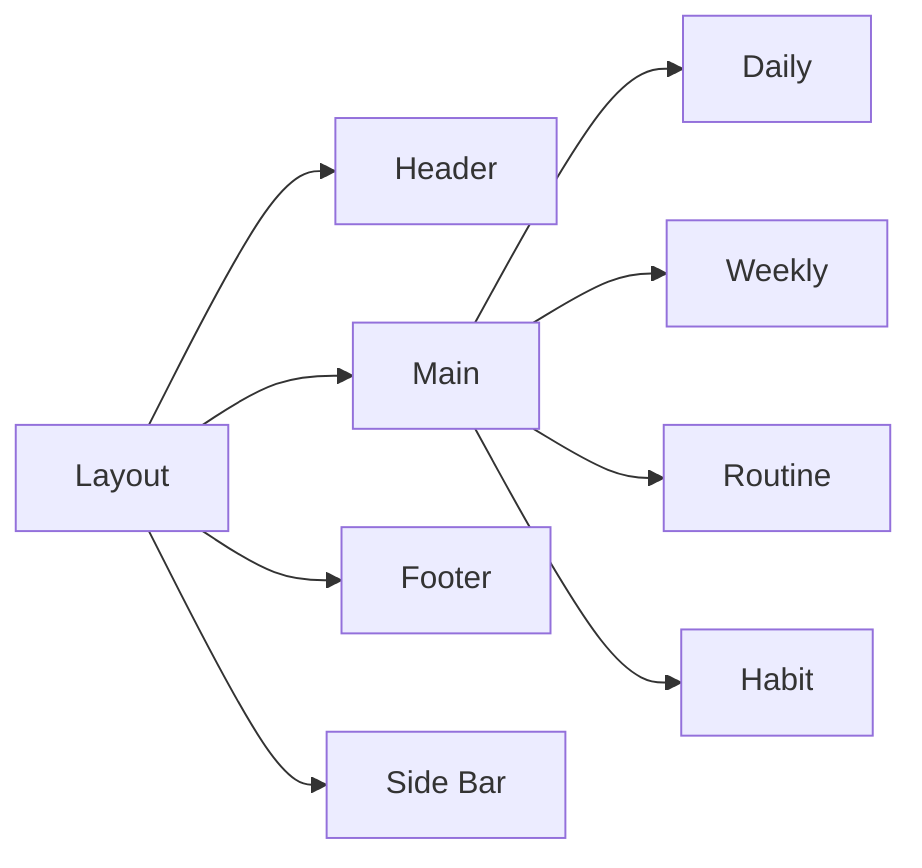
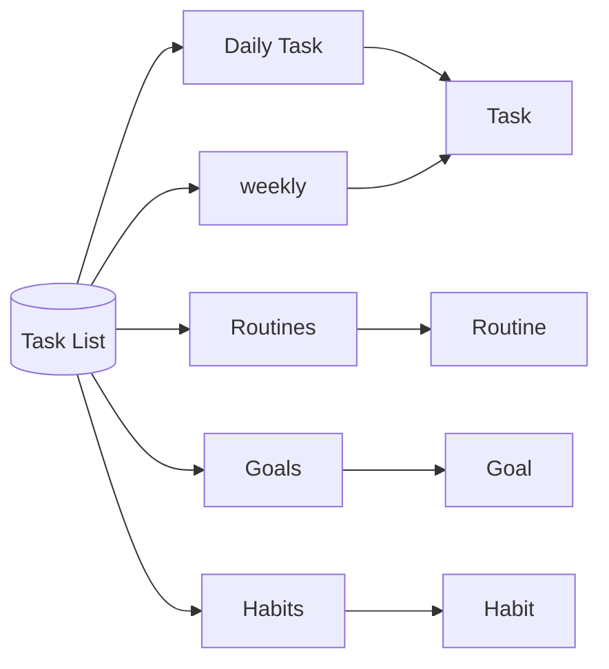
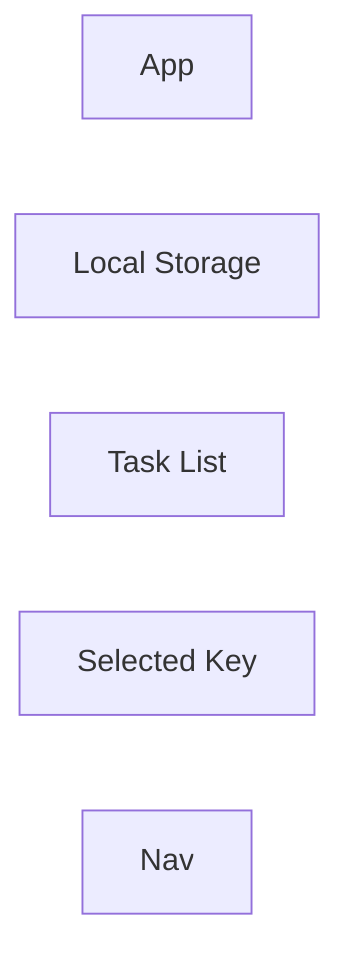

# Task Manager

> A single page application for managing daily tasks, setting up goals, and tracking progress.

## Table of Contents

## Build with

- React
- Ant Design
- react-beautiful-dnd

## Screen Shot

## Usage

## Installation

```bash
git clone https://github.com/MattisZheng/task_manager.git
npm install
```

## Documentation

### Work Flow







### Data Flow



### JSON Format

```json
{
  "tasks": {
    "daily": [
      {
        "name": "name 1",
        "description": "description",
        "status": true
      }
    ],
    "weekly": [
      {
        "name": "weekly 1",
        "description": "description",
        "status": true
      }
    ],
    "goal": [
      {
        "name": "goal 1",
        "deadline": "2049-01-01",
        "description": "goal 1 description"
      }
    ],
    "habit": [
      {
        "name": "habit 1",
        "startDate": "1970-01-01",
        "description": "habit 1 description"
      }
    ],
    "routine": [
      {
        "time": "routine 1",
        "description": "routine 1 description"
      }
    ]
  },
  "history": [],
  "reward": [],
  "settings": []
}
```

## License

## Contribution Guide

## Dev log

v0.0.0

- [x] v0.01 Main Structure
- [x] v0.02 Layout
- [x] v0.03 Routing
- [x] v0.04 Tasks
- [x] v0.05 Routine
- [x] v0.06 Rewards
- [x] v0.07 Local Storage
- [X] v0.08 State Management
- [x] v0.09 Settings
- [ ] v0.10 RWD

v1.0.0 Main Feature

- [ ] v1.1 Drag and Drop
- [ ] v1.2 Clock
- [ ] v1.3 OAuth
- [ ] v1.4 Sync
- [ ] v1.5 Server
- [ ] v1.6 History
- [ ] v1.7 Calendar
- [ ] v1.8 Weather
  - [ ] Get locale
  - [ ] Settings
- [ ] v1.9 Visualization
- [ ] v1.10 Countdown
- [ ] v1.11 Tutorial
- [ ] v1.12 Notification
  - [ ] Info icon
  - [ ] Banner
  - [ ] Announcement
- [ ] v1.13 Reward History

v2.0.0 Side Features

- [ ] v2.1 Mobile
- [ ] v2.2 Desktop
- [ ] v2.3 PWA
- [ ] v2.4 Sync Calendar

v3.0.0 Google

- [ ] Themes
- [ ] i18n
- [ ] Lite Version
