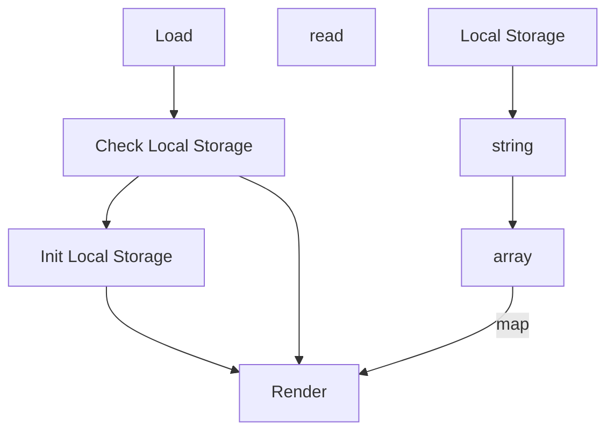
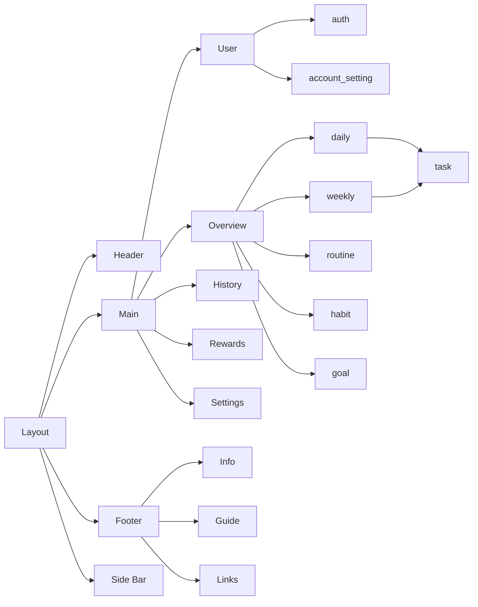
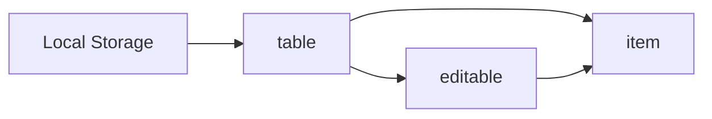

# Sisyphus’ Stone

1. [Build with](#build-with)
2. [Screen Shot](#screen-shot)
3. [Usage](#usage)
4. [Installation](#installation)
5. [Documentation](#documentation)
6. [License](#license)
7. [Dev log](#dev-log)

## Build with

- React
- TypeScript
- Vite
- Vitest
- Ant Design (https://ant.design)
- Drag and Drop(TBD)
  - react-beautiful-dnd
  - react-dnd
  - react-dropzone
  - react-draggable

## Screen Shot

## Usage

## Installation

```bash
git clone https://github.com/MattisZheng/task_manager.git
npm install
```

## Documentation

### Logic Flow



### UI Flow





## License

## Dev log

v0.0.0

- [x] v0.01 Main Structure
- [x] v0.02 Layout
- [x] v0.03 Routing
- [x] v0.04 Tasks
- [x] v0.05 Routine
- [x] v0.06 Rewards
- [x] v0.07 Local Storage
- [x] v0.08 State Management
- [x] v0.09 Settings

v1.0.0 Main Feature

- [ ] v1.01 Drag and Drop
- [ ] v1.02 Clock
- [ ] v1.03 Countdown
- [ ] v1.04 Tutorial
- [ ] v1.05 Notification
- [ ] v1.06 Visualization

v2.0.0 User Experience

- [ ] v2.01 OAuth
- [ ] v2.02 Sync
- [ ] v2.03 Server
- [ ] v2.04 History
- [ ] v2.05 Calendar
- [ ] v2.06 Weather
  - [ ] Get locale
  - [ ] Settings
- [ ] v1.13 Reward History
- [ ] Memory Control

v2.0.0 Side Features

- [ ] v3.01 PWA
- [ ] v3.02 Mobile
- [ ] v3.03 Desktop
- [ ] v3.04 Sync Calendar

v3.0.0 Sync

- [ ] Themes
- [ ] i18n
- [ ] Lite Version
- [ ] Tutorial
